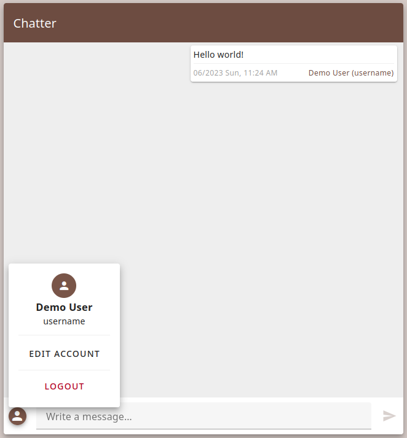

# Chatter
__Chatter__ is a simple chatroom web app written using VueJS for frontend and FastAPI for backend. 

## Screenshots
<details>
<summary><h3>Registration/Login</h3></summary>
<p align="left">
    
    
</p>
</details>

<details>
<summary><h3>User Settings</h3></summary>
<p align="left">
    
    
</p>
</details>

<details>
<summary><h3>Chat</h3></summary>
<p align="left">
    
    
</p>
</details>

## Requirements
### For deployment:
 * Docker
 * Docker Compose
### For development:
 * NodeJS >= 18
 * npm
 * Python >= 3.11

## Installation
__Chatter__ makes use of Docker Compose to setup and bring up both the backend and frontend servers.

### Set secret
__Chatter__ requires a 32 byte secret in hex format to be defined in the `CHATTER_SECRET` environment variable.\
The `.env` file is used for storing the secret.
```
echo "CHATTER_SECRET=$(openssl rand -hex 32)" > .env
```

### Set public API URL
`CHATTER_API_URL` build arg is used for storing the public URL for the backend.\
Just like `CHATTER_SECRET` the `.env` file is used for storing the public API URL.
```
echo "CHATTER_API_URL=http://127.0.0.1:8000/api" >> .env
``` 

### Starting Chatter server
```
docker compose up
```

### Stopping Chatter server
```
docker compose down
```

## Disclaimer
__Here be dragons!__

This is an experimental software I've written to learn a thing or two about VueJS, FastAPI and Docker.

I'm not responsible if Megumin causes an explosion in your house.

## External Libraries
 * [Vue.js](https://vuejs.org/) - [MIT](https://raw.githubusercontent.com/vuejs/core/main/LICENSE)
 * [Vuetify](https://vuetifyjs.com/) - [MIT](https://raw.githubusercontent.com/vuetifyjs/vuetify/master/LICENSE.md)
 * [FastAPI](https://fastapi.tiangolo.com/) - [MIT](https://raw.githubusercontent.com/tiangolo/fastapi/master/LICENSE)
 * [SQLAlchemy](https://www.sqlalchemy.org/) - [MIT](https://raw.githubusercontent.com/sqlalchemy/sqlalchemy/main/LICENSE)